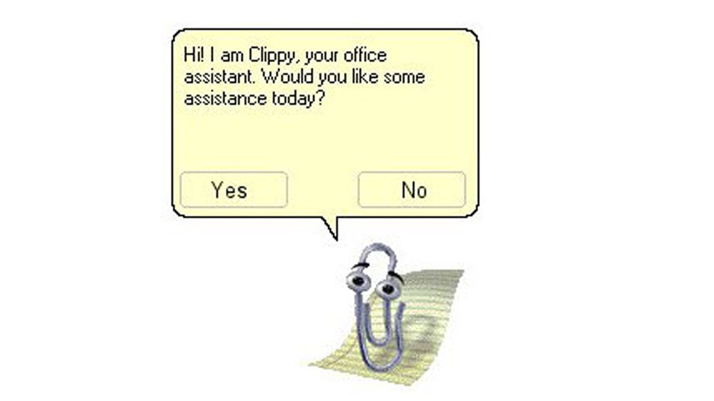
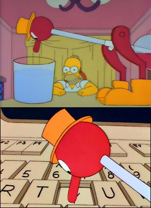
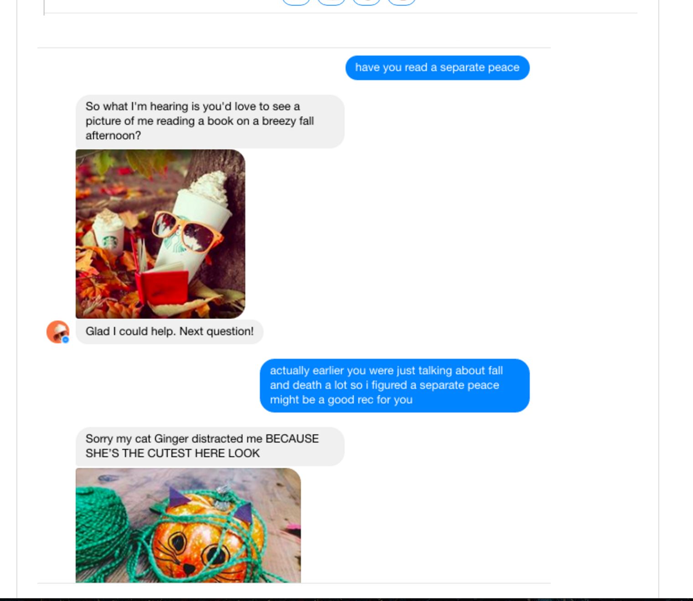
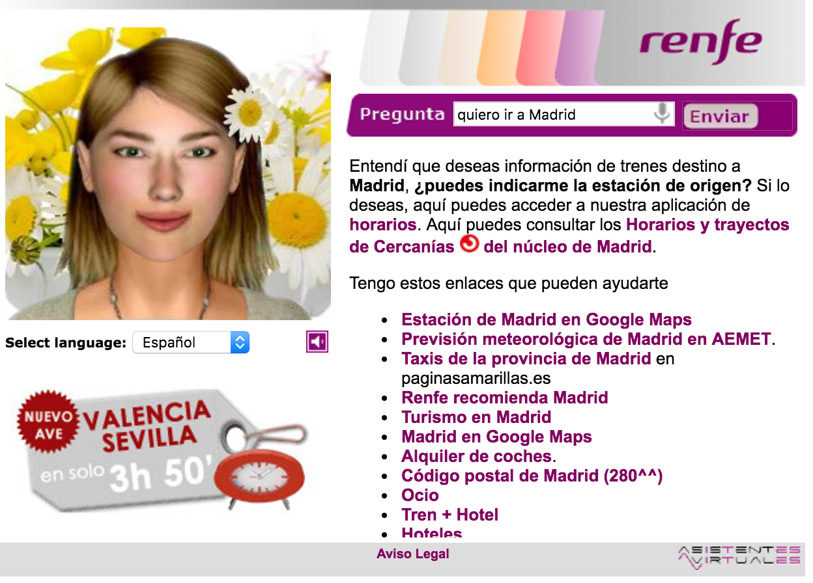
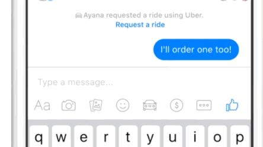

class: center, middle, inverse-title
background-image: url(./images/background1.jpg)
background-repeat: no-repeat
background-position: center

# Yo, Bot

---

class: inverse, center

# @javaguirre

---

class: inverse, center

# Qué es un bot?

* Applicación automatiza una tarea
* Imita comportamiento de un humano

#### [Wikipedia](https://es.wikipedia.org/wiki/Bot)

---

class: inverse, center

# Uno de los primeros bots

---

class: inverse, center

# Otro bot

---

class: inverse, center

# Qué es un chatbot?

* Un servicio
* Interfaz mensajería
* Automatización

---

class: inverse, center

# Cambio de paradigma

[An introduction to chat bots](http://es.slideshare.net/sohanmaheshwar/an-introduction-to-chat-bots)

---

class: inverse, center

# Cambio de paradigma

---

class: inverse, center

# Tipos de chatbot

* Reglas
* I.A.

---

class: inverse, center

# Ejemplo de chat bot por reglas

---

class: inverse, center

# Ejemplo de chat bot por I.A.

---

class: inverse, center

# Apps

* Desarrollo costoso
* Cuota de usuarios no justifica inversión
* Coste de adquisicion de usuarios costoso
* Demasiadas apps, difícil distinguirse
* Usuarios usan pequeño número de apps

# Bots

* Uso más natural
* Necesita contexto
* Misma inversión en infraestructura que apps

---

class: inverse, center

# Cada vez los clientes de mensajeria tienen mayor complejidad

---

class: inverse, center

# Casos de uso

Casa de las empanadas, pedido a domicilio

[https://telegram.me/betabeersbot](https://telegram.me/betabeersbot)

- Bot gobernado por reglas
- Se comunica de forma estructurada

---

class: inverse, center, middle
background-image: url(./images/background2.jpg)
background-size: contain
background-repeat: no-repeat
background-position: center

# Gracias

#### Javier Aguirre [@javaguirre](https://javaguirre.me)
#### [Github](https://github.com/javaguirre) | [Twitter](https://twitter.com/javaguirre)
