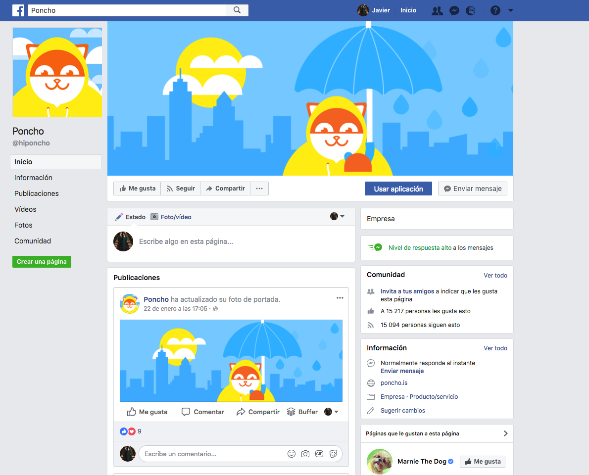

class: center, middle, inverse-title
background-image: url(./images/background1.jpg)
background-repeat: no-repeat
background-position: center

# Chatbots IOI

---

class: inverse, center

# @javaguirre

[](https://www.reply.ai)


---

class: inverse, center

# Qué es un bot?

* Applicación automatiza una tarea
* Imita comportamiento de un humano

#### [Wikipedia](https://es.wikipedia.org/wiki/Bot)

---

class: inverse, center

# Uno de los primeros bots


---

class: inverse, center

# Otro bot


---

class: inverse, center

# Antes de los bots


---

class: inverse, center

# Después de los Bots


---

class: inverse, center

# Qué es un chatbot?

* Un servicio
* Interfaz mensajería
* Automatización

---

class: inverse, center

# Cambio de paradigma


[An introduction to chat bots](http://es.slideshare.net/sohanmaheshwar/an-introduction-to-chat-bots)

---

class: inverse, center

# Cambio de paradigma


---

class: inverse, center

# Tipos de chatbot

* Reglas
* I.A.

---

class: inverse, center

# Ejemplo de chat bot por reglas


---

class: inverse, center

# Ejemplo de chat bot por I.A.


---

class: inverse, center

# Ejemplo de chat bot por I.A. (II)


---

class: inverse, center

# Uso de un chatbot



---

class: inverse, center

# Uso de un chatbot (II)


---

class: inverse, center

# Uso de un chatbot (III)


---

class: inverse, center

# Apps (vs Bots)

* Desarrollo costoso
* Cuota de usuarios no justifica inversión
* Coste de adquisicion de usuarios costoso
* Demasiadas apps, difícil distinguirse
* Usuarios usan pequeño número de apps

---

class: inverse, center


# Bots (vs Apps)

* Uso más natural
* Necesita contexto
* Misma inversión en infraestructura que apps

---

class: inverse, center

# Cada vez los clientes de mensajeria tienen mayor complejidad


---

class: inverse, center

# Por dónde empezar

* Chatfuel
* Manychat

---

class: inverse, center

# Voz, asistentes conversacionales

* Móvil (Siri, Bixby, Cortana)
* Casa (Google Home, Alexa)

https://www.youtube.com/watch?v=hhBasJyZ_QM#t=29s

---

class: inverse, center

# Voz (II)


---

class: inverse, center

# Poca aceptación de momento

<b>Alexa, set timer five minutes</b>
<br/>
<b>Alexa, set alarm at 10am</b>


---

class: inverse, center

# Spotify

* Alexa, play late night jazz on spotify


---

class: inverse, center

# Cómo funciona

* Alexa, ask "skill" to do "something"
* Alexa, "something" with "skill"

---

class: inverse, center

# Contras actuales

* Apps o dispositivos no disponibles todavía
* Pocos idiomas


---

class: inverse, center

# Contras actuales (II)

* Seguridad


---

class: inverse, center

# Tres conceptos

* Agente que engloba varias acciones (intents)
* Acción/Intent, es una acción que queremos que ejecute
* Entidad, es un dato necesario para llevar a cabo la acción

---

class: inverse, center

# Uso

* ¿Qué tiempo hace hoy en Córdoba?

```
Intent: informacion_tiempo
Entities: fecha: hoy, localizacion: Córdoba, ES
```

* Hoy está soleado, tendremos 25 grados de máxima

---

class: inverse, center

# Desarrollo de bots de I.A. (I)


---

class: inverse, center

# Desarrollo de bots de I.A. (II)


---

class: inverse, center

# Por dónde empezar

* Dialogflow

---

class: inverse, center, middle, bigger

# Gracias
#### Javier Aguirre [@javaguirre](https://javaguirre.me)
#### [Github](https://github.com/javaguirre) | [Twitter](https://twitter.com/javaguirre)
